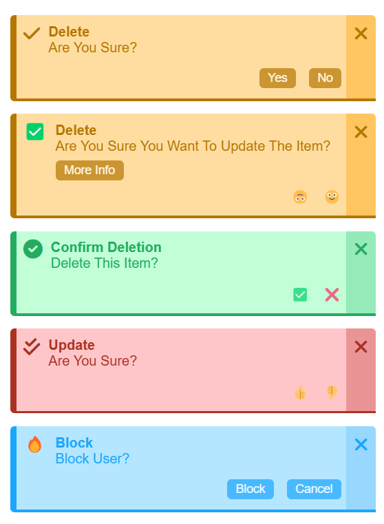
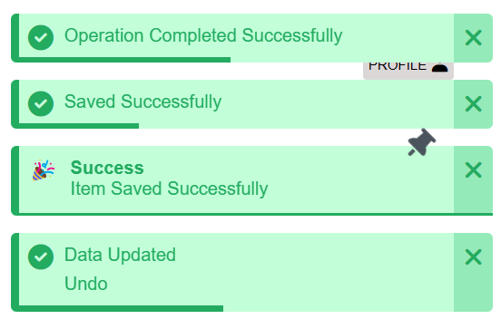
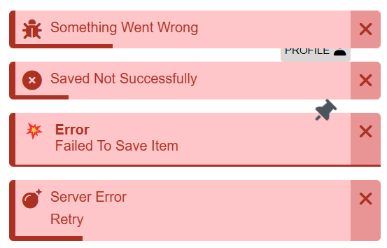
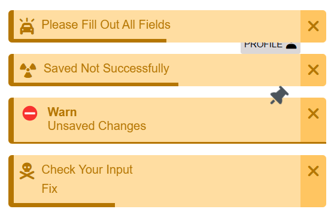
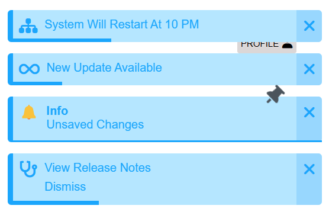
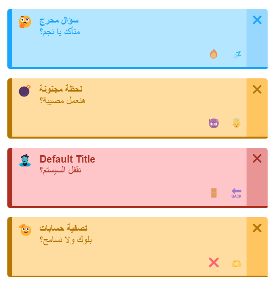
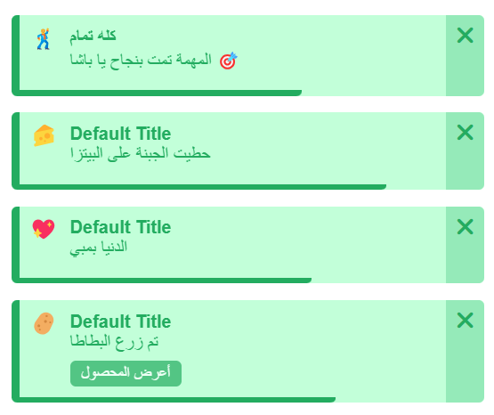
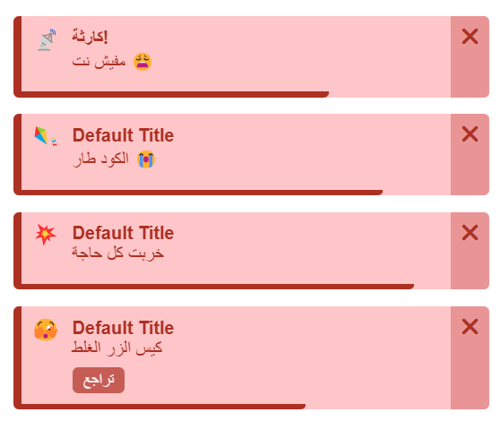
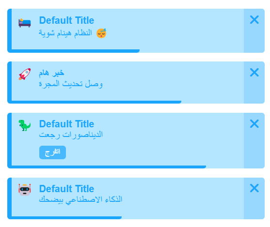
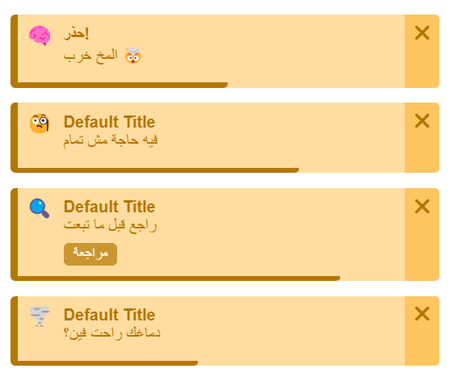

## Laravel Itoast and Confirm

#### A simple and professional package for displaying beautiful toast notifications and confirmation alerts in your Laravel app.

## [My Package](https://github.com/IslamAlsayed/itoast-and-confirm-package)

## ✅ Features

Multiple notification types: ✅ Success, ❌ Error, ⚠️ Warning, ℹ️ Info

- Supports icons and emojis
- Custom titles and messages
- Pin option (persistent toasts)
- Custom display durations
- Position control (e.g., top, right)
- Direction support: LTR and RTL
- Themes for all toast types
- Confirm/Cancel buttons
- Extra customizable actions

## Installation

1. Install the package via Composer:

```php
composer require islamalsayed/itoast
```

#### 2. Publish assets:

```php
php artisan vendor:publish --tag=itoast-all
```

#### 3. Injection:

```php
php artisan itoast:inject
```

### Usage

You can run `confirm` using any of the following methods:

### Confirms (إشعار تأكيد)

#### ✅ 1.1. Using Helper functions

```php
addConfirm('Operation completed successfully');
addConfirmSuccess('Operation completed successfully');
addConfirmError('Are you sure?')->icon('check')->title('Error');
addConfirmWarn('Please fill out all fields')->icon('check')->title('Warn');
addConfirmInfo('Block user?')->icon('check')->title('info');
```

or

#### ✅ 1.2. Using the `IToast` static class

```php
IToast::confirm()->icon('check')->title('delete');
IToast::confirm('Are you sure you want to update the item?')->title('update')->emoji('✅')->onConfirm('🙃')->onCancel('🙂')->withAction('More Info', '/details');
IToast::confirm('Delete this item?')->title('delete')->icon('circle-check')->onConfirm('✅')->onCancel('❌')->theme('success');
IToast::confirm('Are you sure?')->icon('check-double')->title('Update')->theme('error')->onConfirm('👍')->onCancel('👎');
IToast::confirm('Block user?')->emoji('🔥')->icon('square-check')->title('Block')->theme('info')->onConfirm('Block')->onCancel('Cancel');
```

or

#### ✅ 1.3. Using `IToastManager` the class-based approach

```php
(new IToastManager)->add('confirm', 'Saved successfully')->theme('success');
(new IToastManager)->add('confirm', 'Delete this item?')->theme('error');
(new IToastManager)->add('confirm', 'Are you sure?')->theme('warn');
(new IToastManager)->add('confirm', 'Block user?')->theme('info');
```

### Confirms



You can run `itoast` using any of the following methods:

### Itoasts (إشعار لحظي)

#### ✅ 2. Using the `IToast` static class

```php
addItoastSuccess('Operation completed successfully')->duration('2s');
addIToast('success', 'Saved successfully')->duration(5000);
(new IToastManager)->add('success', 'Item saved successfully')->pin()->emoji('🎉')->title('Success')->duration('0.3s');
IToast::success('Data updated')->icon('check-circle')->duration('0.9s')->withAction('Undo', '/undo-url');
```

### Success (إشعار نجاح)



#### ✅ 3. Using the `IToast` static class

```php
addItoastError('Something went wrong')->icon('bug')->duration('2s');
addIToast('error', 'Saved not successfully')->pin();
(new IToastManager)->add('error', 'Failed to save item')->emoji('💥')->title('Error')->duration('0.3s');
IToast::error('Server error')->icon('bomb')->duration('0.9s')->withAction('Retry', '/retry');
```

### Error (إشعار خطأ)



#### ✅ 4. Using the `IToast` static class

```php
addItoastWarn('Please fill out all fields')->icon('car-on')->duration('2s');
addIToast('warn', 'Saved not successfully')->pin()->icon('radiation');
(new IToastManager)->add('warn', 'Unsaved changes')->emoji('⛔')->title('warn')->duration('0.3s');
IToast::warn('Check your input')->icon('skull-crossbones')->duration('0.9s')->withAction('Fix', '/fix-form');
```

### Warn (إشعار تحذير)



#### ✅ 5. Using the `IToast` static class

```php
addItoastInfo('System will restart at 10 PM')->icon('sitemap')->duration('3s');
addIToast('info', 'New update available')->pin()->icon('infinity');
(new IToastManager)->add('info', 'Unsaved changes')->emoji('🔔')->title('info');
IToast::info('View release notes')->icon('stethoscope')->duration('1.5s')->withAction('Dismiss', '/dismiss');
```

### Info (إشعار معلومات)



#### ✅ 6. Using Laravel session (flash)

```php
# Direct session with use flash for temporary messages
session()->flash('warn', 'Please check your inputs');
session()->flash('success', [
    'title' => 'Saved',
    'message' => 'Saved successfully',
    'emoji' => '🔥',
    'duration' => '2m',
    'position' => 'right',
    'pin' => 'pin',
    'actions' => [['label' => 'details', 'url' => '/details'], ['label' => 'undo', 'url' => '/oops']],
]);
```

#### ✅ 7. With redirect responses

```php
return redirect()->back()->with('success', 'Action completed');
return redirect()->route('dashboard')->with('success', 'Welcome you in dashboard');
return redirect()->route('home')->with('error', 'Something went wrong');
return redirect()->route('profile')->with('warn', 'Please fill out all fields');
return redirect()->route('home')->with('info', 'View release notes');
```

### This package also fully supports Arabic notifications and RTL layout.

### Confirms (إشعار تأكيد)



### Success (إشعار نجاح)



### Error (إشعار خطأ)



### Warn (إشعار تحذير)



### Info (إشعار معلومات)



You can also link additional options:

### Properties

```php
public $type;
public $message;
public $title = null;
public $emoji = null;
public $icon = null;
public $duration = null;
public $position = null;
public $pin = null;
public $theme = null;
public $dir = null;
public $confirm = null;
public $cancel = null;
public $actions = [];
```

| Property | Type   | Description                                            |                                                  |
| :------- | :----- | :----------------------------------------------------- | :----------------------------------------------- |
| type     | string | some are require                                       | success, error, info, warn                       |
| message  | string | message text                                           | itoast message                                   |
| title    | string | null                                                   | (Optional) title                                 |
| emoji    | string | null                                                   | Emoji to show next to the title                  |
| icon     | string | null                                                   | Icon name (FontAwesome or emoji)                 |
| duration | int    | null                                                   | Duration (ms/s/m/h)                              |
| position | string | null                                                   | Display position: top, right                     |
| pin      | bool   | null                                                   | If true, toast won't auto-hide                   |
| theme    | string | null                                                   | success, error, info, warn                       |
| dir      | string | null                                                   | Text direction: ltr or rtl                       |
| confirm  | string | null                                                   | Confirm button label (Yes)                       |
| cancel   | string | null                                                   | Cancel button label (No)                         |
| actions  | array  | [['label' => 'details' 'url' => '/details-url'], ... ] | Array of actions: ['label' => ..., 'url' => ...] |

---

## 💡 Future Suggestions

- Support for queueing multiple toasts in sequence
- Audio alert support
- Persist toast in session or cookies after redirect
- Built-in animations like fadeIn, slideOut, etc.

---

## ➖ 🛠️Contributing

Have an idea or improvement? Contributions are welcome!

- Open an issue
- Or submit a pull request

---

## ➖ 📬 Contact Me

- 📧 **Email**: [eslamalsayed8133@gmail.com](mailto:eslamalsayed8133@gmail.com)
- 💼 **LinkedIn**: [IslamAlsayed](https://www.linkedin.com/in/islam-alsayed7)
- 💼 **Facebook**: [IslamAlsayed](https://www.facebook.com/islamalsayed00)

---

> ✨ ✨ Developed to simplify user notifications in a clean and flexible way.
